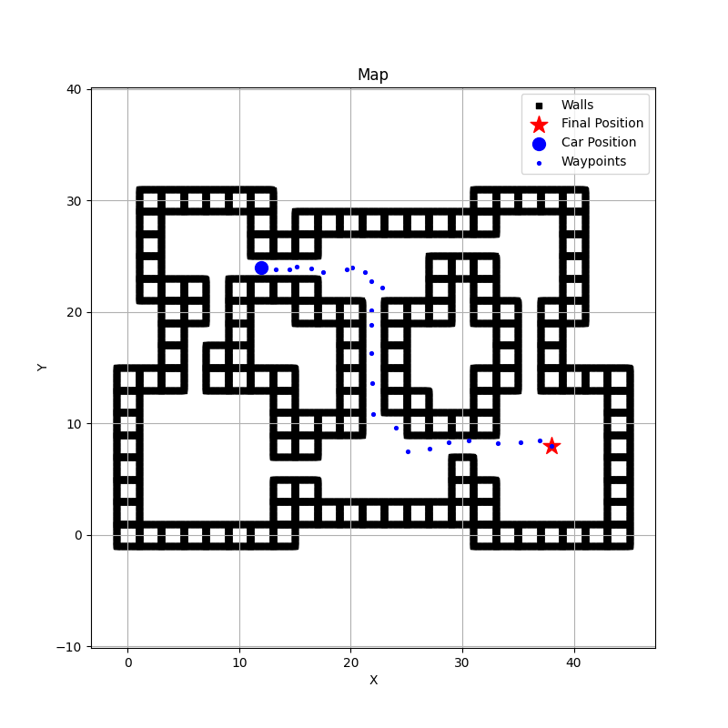

# CMPE434 - Introduction to Robotics Term Project

## Introduction

In modern robotics, autonomous navigation in dynamic environments is a fundamental challenge. Robots not only need to find a path to their target but also adapt their motion to avoid collisions with moving obstacles. This term project addresses that challenge within a simulated environment using **MuJoCo** — a high-fidelity physics engine for robot simulation.

The primary goal of the project was to enable a robot to reach a predefined goal position without colliding with any obstacles in its environment. Unlike static settings, the simulation contains **dynamic obstacles**, making the problem more realistic and complex.

To solve this, a **hybrid motion planning approach** was implemented:
- **Probabilistic Roadmap (PRM)** was used as a **global planner** to generate a collision-free roadmap of the environment.
- **Artificial Potential Field (APF)** was employed as a **local planner** to reactively avoid dynamic obstacles.

This blog post walks through the motivation, methodology, implementation details, and results of the project.

## Why PRM and APF?

Choosing the right motion planning algorithms is critical for balancing performance, efficiency, and adaptability — especially in environments with dynamic obstacles.

### Why Probabilistic Roadmap (PRM) for Global Planning?

PRM is a sampling-based planner that works particularly well in **high-dimensional configuration spaces** and **static environments**. For this project, it was ideal for global planning because:
- It **preprocesses the static environment** to build a roadmap offline, which saves computation during execution.
- It is **scalable** and can efficiently handle complex spaces without requiring an explicit map decomposition.

### Why Artificial Potential Field (APF) for Local Planning?

  

APF was chosen for local planning due to its **real-time responsiveness** and **simplicity**:
- APF provides **fast reactions** to dynamic obstacles by treating them as repulsive forces, while the goal attracts the robot.
- It works well as a **local adjustment layer**, modifying the global path from PRM to avoid new or moving obstacles.
- It’s lightweight and easy to integrate with existing planners like PRM, making it a practical choice for combining global foresight with local agility.

By combining PRM and APF, the system benefits from both **efficient global path generation** and **adaptive local obstacle avoidance**, making it well-suited for navigating a dynamic MuJoCo environment.

## Problems Faced and How I Solved Them

During the project, I ran into a few challenges that affected the robot's navigation performance. Here are the two main ones:

### 1. Trouble with Sharp Turns at High Speed

At higher speeds, the robot couldn't take sharp turns effectively. It would often overshoot or drift wide, which caused instability or even collisions.

**Solution:**  
I added a simple fix by **scaling the velocity based on the steering angle**. If the robot is turning sharply, it moves slower; if the path is straight, it speeds up. This helped keep the movement more stable and realistic.

### 2. Weak Reactions to Dynamic Obstacles

In early tests, the robot didn’t respond well to moving obstacles — it reacted too late and sometimes got dangerously close.

**Solution:**  
I **tuned the parameters** of the Artificial Potential Field (APF) algorithm. By increasing the repulsive force and its range, the robot started reacting earlier and avoided obstacles more safely.

These small changes made a big difference in the system's performance.

## Results

After implementing the PRM and APF planners and making the necessary adjustments, the robot was able to navigate successfully in the MuJoCo simulation environment.

### Key Outcomes:

- ✅ The robot consistently reached the goal without any collisions.
- 🔁 It was able to **replan and adjust its path** when dynamic obstacles moved into its way.
- ⚙️ The combination of PRM (for global planning) and APF (for local obstacle avoidance) worked well together, balancing long-term pathfinding with short-term reactivity.

While there’s still room for improvement in terms of more advanced obstacle prediction or smoothing the trajectory further, the system successfully met the project’s main goal: **reaching the target in a dynamic environment without collisions**.

